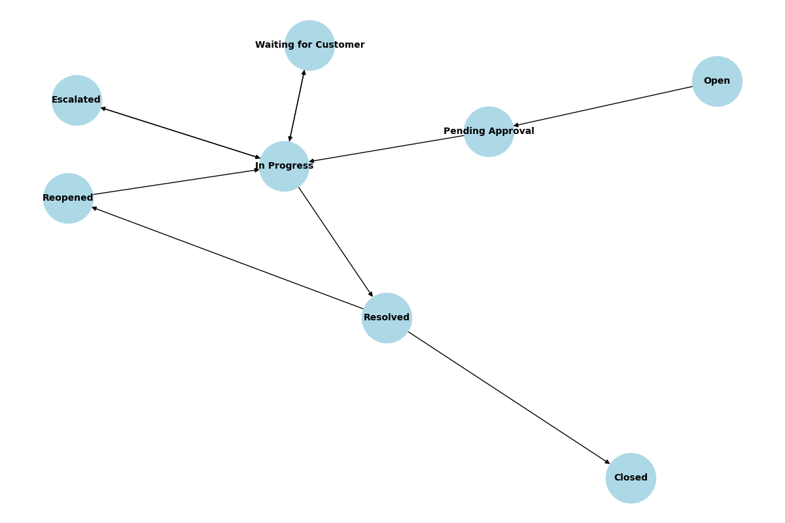

# 🛠️ IT Support Ticketing System – Jira Project Setup

This repository provides a comprehensive guide to setting up an **IT Support Ticketing System** using **Jira Service Management**, designed to reflect real-world industry practices.

---

## 📁 Project Overview

- **Project Type**: Jira Service Management
- **Template**: IT Service Management
- **Project Name**: IT Support Desk
- **Project Key**: ITSD

---

## 🧩 Issue Types

| Issue Type       | Description |
|------------------|-------------|
| Incident         | Unplanned interruptions (e.g., Wi-Fi not working) |
| Service Request  | Standard requests (e.g., Request new laptop) |
| Change Request   | Changes to systems or services |
| Problem          | Root cause analysis of recurring issues |
| Task             | General work items |

---

## 🔄 Enhanced Workflow Design

### Workflow Steps

- **Open** → **Pending Approval** → **In Progress**
- **In Progress** → **Escalated** → **In Progress**
- **In Progress** → **Waiting for Customer** → **In Progress**
- **In Progress** → **Resolved**
- **Resolved** → **Reopened** → **In Progress**
- **Resolved** → **Closed**

This workflow allows for escalation, customer feedback, and re-opening of resolved tickets.

---

## 👥 Roles and Permissions

| Role     | Description |
|----------|-------------|
| Agents   | IT support staff who work on tickets |
| Customers| Employees who raise tickets |
| Admins   | Manage project settings and configurations |

Permissions should be configured to ensure only agents can transition certain statuses or edit sensitive fields.

---

## 📋 Request Types (Customer Portal)

| Request Type         | Mapped Issue Type |
|----------------------|-------------------|
| Report a Problem     | Incident          |
| Request New Equipment| Service Request   |
| Reset Password       | Service Request   |

Each request type can have custom forms and fields for better user experience.

---

## ⚙️ Automation Rules

- Auto-assign tickets based on category or keywords
- Send reminders for pending approvals
- Auto-close tickets after 5 days of inactivity
- Notify customers when ticket status changes

---

## 📊 SLAs and Reporting

| SLA Metric           | Target |
|----------------------|--------|
| First Response Time  | 2 hours |
| Resolution Time      | 1 business day |

Use dashboards to track:
- Ticket volume
- SLA breaches
- Agent performance

---

## 🚀 How to Use

1. Create a new Jira Service Management project using the ITSM template.
2. Configure issue types and workflows as described.
3. Set up request types and forms for the customer portal.
4. Define roles and permissions.
5. Implement automation rules.
6. Monitor SLAs and generate reports.

---

## 🖼️ Workflow Diagram

---

## 📬 Feedback

Feel free to fork this repository and customize it for your organization. Contributions and suggestions are welcome!
